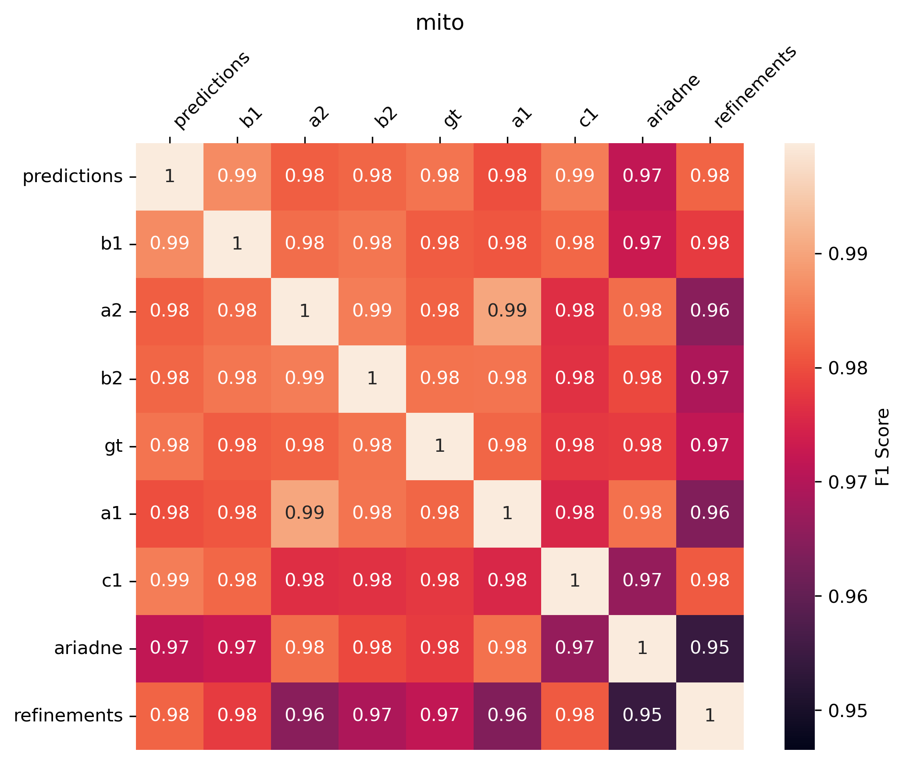
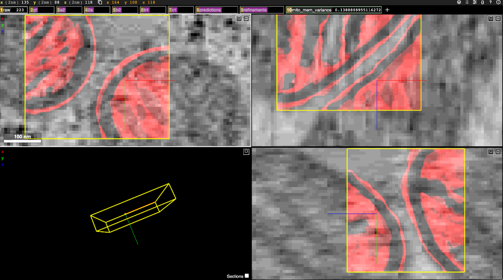

# Annotator Metrics Evaluator
all-to-all metrics           |  annotator variance
:-------------------------:|:-------------------------:
 | 

This codebase is for analyzing and comparing annotator performance for 3D Electron Microscopy (EM) organelle annotations. These annotations are used as ground truth for machine learning algorithms. In particular, we are interested in comparing annotator trials in an all-to-all way across a variety of annotation metrics so we can better determine inter- and intra-annotator variance. This enables identifying those annotators who may need more training. For these calculations, we use [CNNectome](https://github.com/saalfeldlab/CNNectome/tree/master).

The code contains a variety of functions that are useful for such analysis. The main four of interest are the following:
1. `copy_data`: This function copies annotator data into a new directory organized in a way better suited for the remainder of the analysis code.
2. `calculate_all_to_all`: This function uses Dask to actually do the all-to-all comparison.
3. `create_variance_images`: This calculates the variance across all manual annotations on a per-voxel basis.
4. `get_neuroglancer_view_of_crop`: This provides a neuroglancer link to actually view and compare the annotation data.

More details and a concrete example can be found in the `metric_evaluations.ipynb` python notebook.

## Installation

To install and use this repository:
1. Clone the repository: `git clone https://github.com/janelia-cosem/annotator-metrics`.
2. Move into the directory: `cd annotator-metrics`.
3. Install the conda environment: `conda env create -f environment.yml`.
4. Activate the conda environment: `conda activate annotator-metrics`.
5. Install the package: `pip install .`, or if you want to install it for development, `pip install -e .`.

